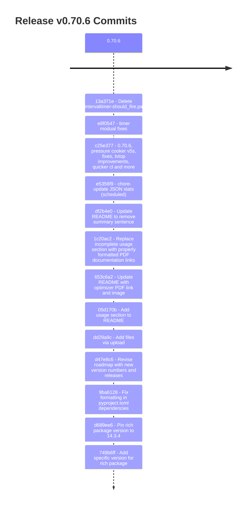
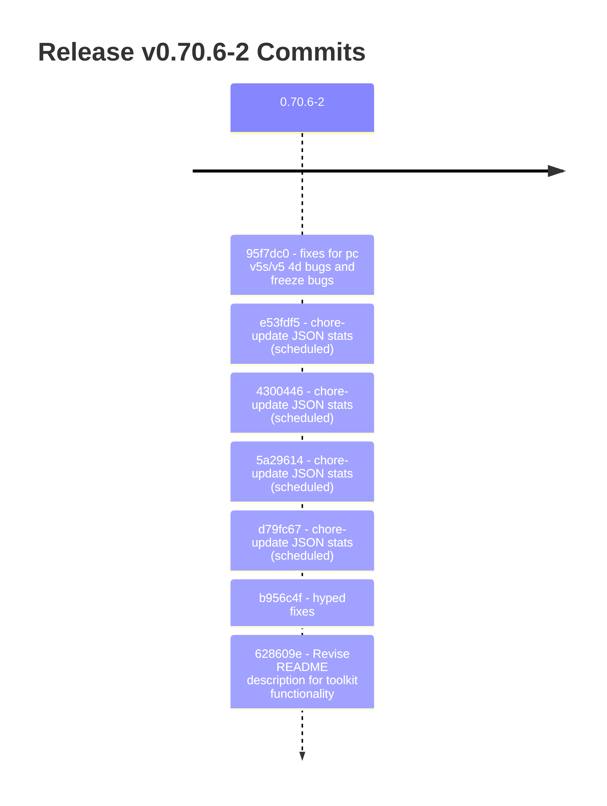
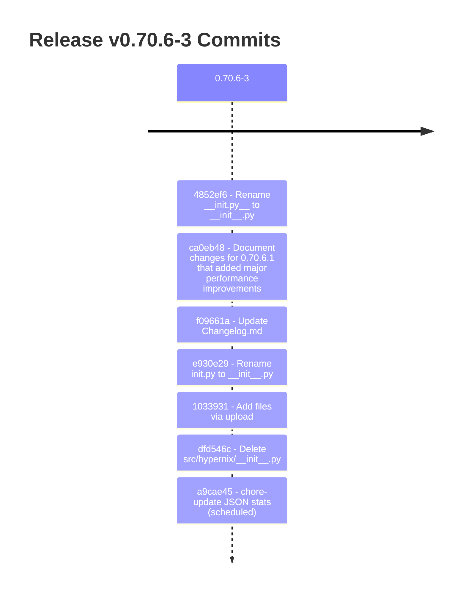
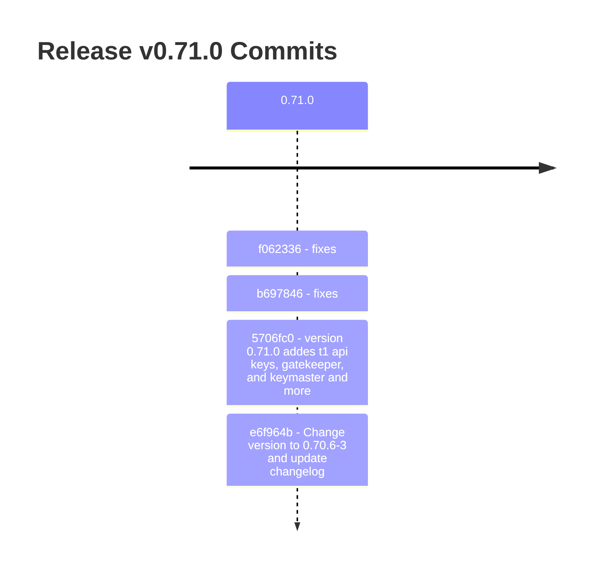

# HyperNix Release Timeline

This page contains an automatically updated timeline of all public releases.

## Release v0.70.6 (2026-07-15)

## Release v0.70.6-2 (2026-07-19)

## Release v0.70.6-3 (2026-07-20)

## Release v0.71.0 (2026-07-20)

