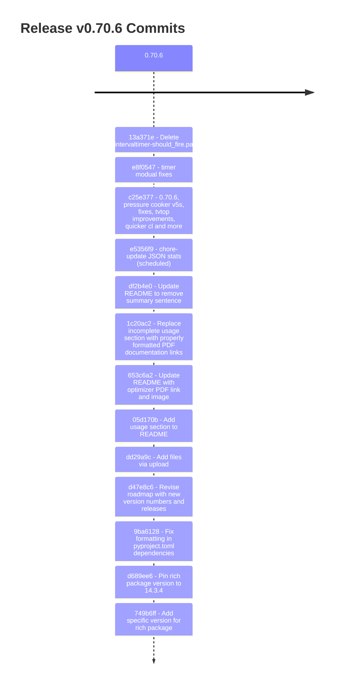

# HyperNix Release Timeline

This page contains an automatically updated timeline of all public releases.

## Release v0.70.6 (2026-07-15)

```mermaid
timeline
    title Release v0.70.6 Commits
    0.70.6
        : 13a371e - Delete fix-intervaltimer-should_fire.patch
        : e8f0547 - timer modual fixes
        : c25e377 - 0.70.6, pressure cooker v5s, fixes, tvtop improvements, quicker cl and more
        : e5356f9 - chore- update JSON stats (scheduled)
        : df2b4e0 - Update README to remove summary sentence
        : 1c20ac2 - Replace incomplete usage section with properly formatted PDF documentation links
        : 653c6a2 - Update README with optimizer PDF link and image
        : 05d170b - Add usage section to README
        : dd29a9c - Add files via upload
        : d47e8c6 - Revise roadmap with new version numbers and releases
        : 9ba6128 - Fix formatting in pyproject.toml dependencies
        : d689ee6 - Pin rich package version to 14.3.4
        : 749b6ff - Add specific version for rich package
```

