# HyperNix Release Timeline

This page contains an automatically updated timeline of all public releases.

## Release v0.70.6 (2026-07-15)

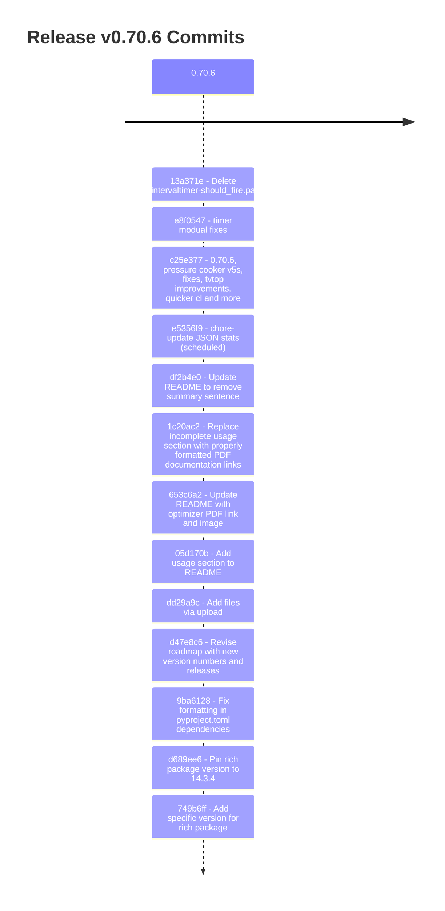
```mermaid
timeline
    title Release v0.70.6 Commits
    0.70.6
        : 13a371e - Delete fix-intervaltimer-should_fire.patch
        : e8f0547 - timer modual fixes
        : c25e377 - 0.70.6, pressure cooker v5s, fixes, tvtop improvements, quicker cl and more
        : e5356f9 - chore- update JSON stats (scheduled)
        : df2b4e0 - Update README to remove summary sentence
        : 1c20ac2 - Replace incomplete usage section with properly formatted PDF documentation links
        : 653c6a2 - Update README with optimizer PDF link and image
        : 05d170b - Add usage section to README
        : dd29a9c - Add files via upload
        : d47e8c6 - Revise roadmap with new version numbers and releases
        : 9ba6128 - Fix formatting in pyproject.toml dependencies
        : d689ee6 - Pin rich package version to 14.3.4
        : 749b6ff - Add specific version for rich package
```

## Release v0.70.6-2 (2026-07-19)

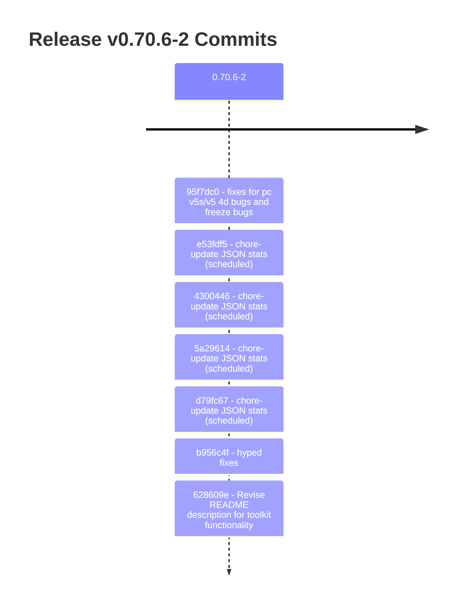
```mermaid
timeline
    title Release v0.70.6-2 Commits
    0.70.6-2
        : 95f7dc0 - fixes for pc v5s/v5  4d bugs and freeze bugs
        : e53fdf5 - chore- update JSON stats (scheduled)
        : 4300446 - chore- update JSON stats (scheduled)
        : 5a29614 - chore- update JSON stats (scheduled)
        : d79fc67 - chore- update JSON stats (scheduled)
        : b956c4f - hyped fixes
        : 628609e - Revise README description for toolkit functionality
```

## Release v0.70.6-3 (2026-07-20)

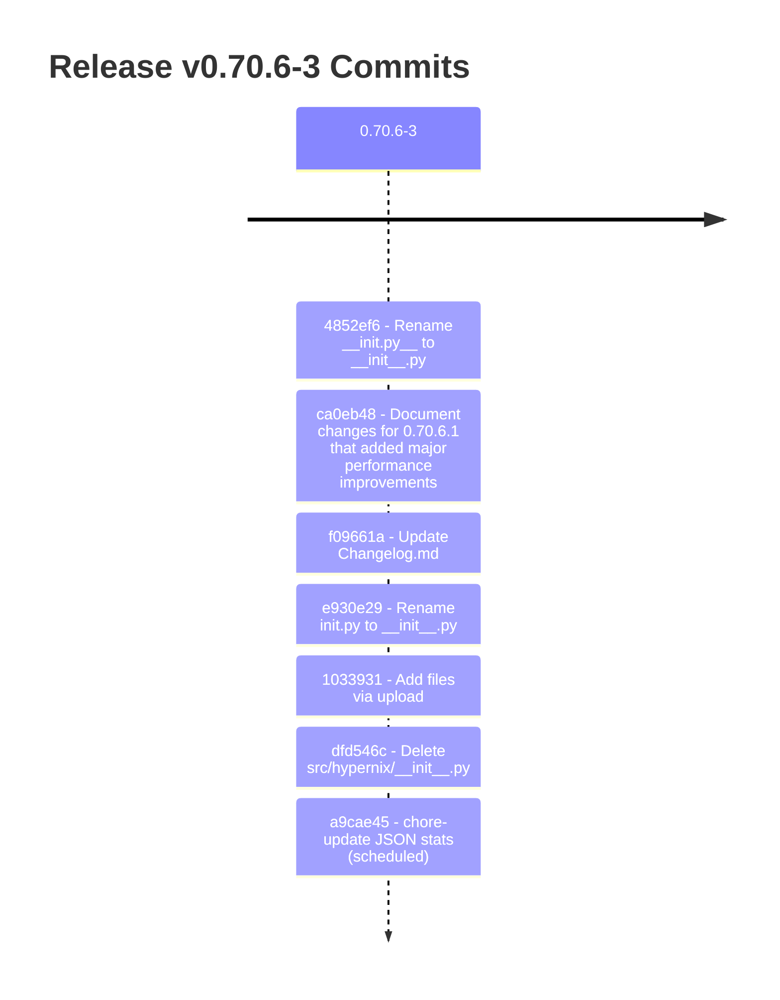
```mermaid
timeline
    title Release v0.70.6-3 Commits
    0.70.6-3
        : 4852ef6 - Rename __init.py__ to __init__.py
        : ca0eb48 - Document changes for 0.70.6.1 that added major performance improvements
        : f09661a - Update Changelog.md
        : e930e29 - Rename init.py to __init__.py
        : 1033931 - Add files via upload
        : dfd546c - Delete src/hypernix/__init__.py
        : a9cae45 - chore- update JSON stats (scheduled)
```

## Release v0.71.0 (2026-07-20)

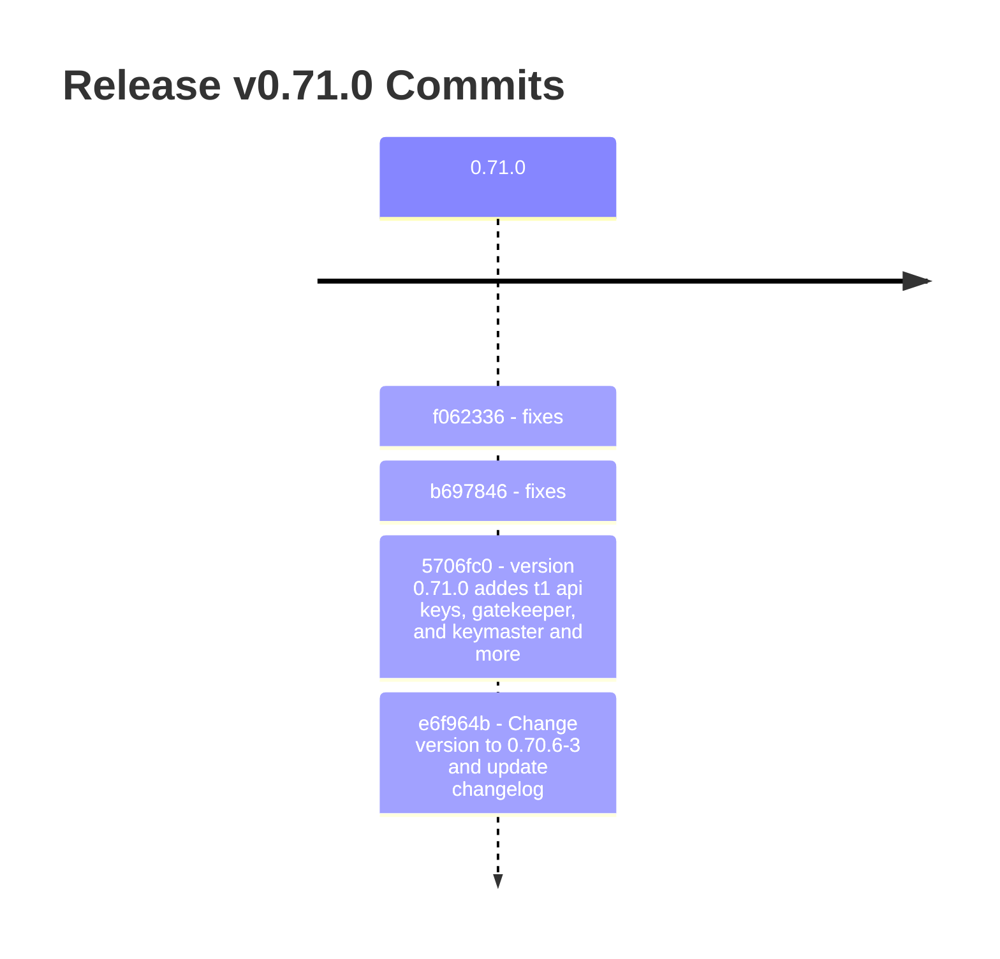
```mermaid
timeline
    title Release v0.71.0 Commits
    0.71.0
        : f062336 - fixes
        : b697846 - fixes
        : 5706fc0 - version 0.71.0 addes t1 api keys, gatekeeper, and keymaster and more
        : e6f964b - Change version to 0.70.6-3 and update changelog
```

## Release v0.71.1 (2026-07-21)

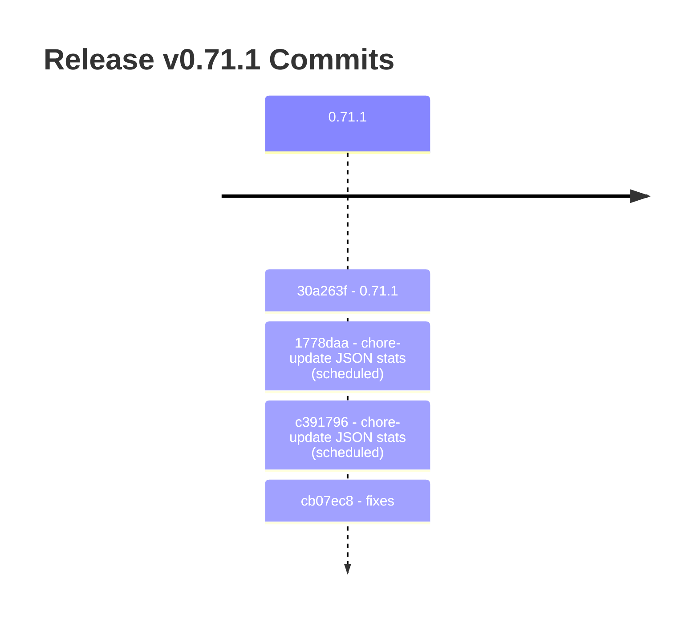
```mermaid
timeline
    title Release v0.71.1 Commits
    0.71.1
        : 30a263f - 0.71.1
        : 1778daa - chore- update JSON stats (scheduled)
        : c391796 - chore- update JSON stats (scheduled)
        : cb07ec8 - fixes
```

## Release v0.71.2 (2026-07-22)

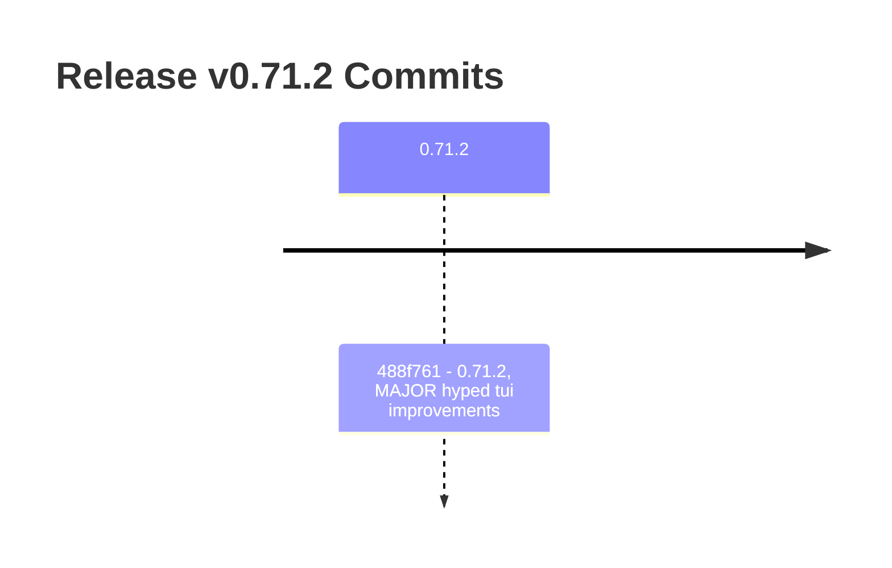
```mermaid
timeline
    title Release v0.71.2 Commits
    0.71.2
        : 488f761 - 0.71.2, MAJOR hyped tui improvements
```

## Release v0.71.3 (2026-07-22)

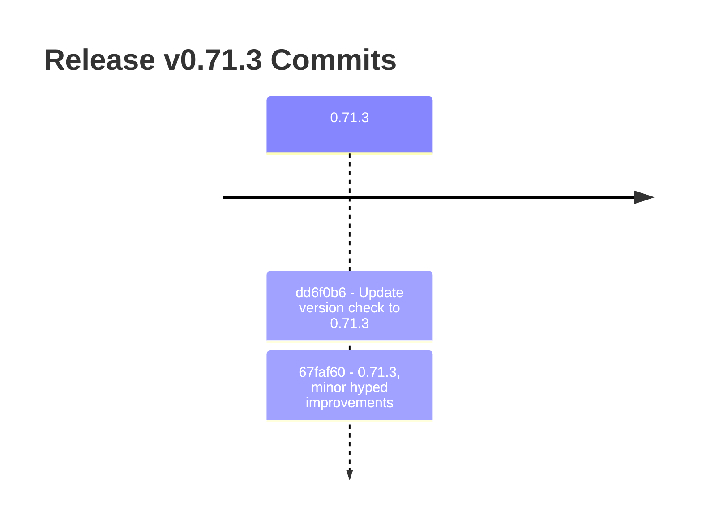
```mermaid
timeline
    title Release v0.71.3 Commits
    0.71.3
        : dd6f0b6 - Update version check to 0.71.3
        : 67faf60 - 0.71.3, minor hyped improvements
```

## Release v0.71.4b1 (2026-07-26)

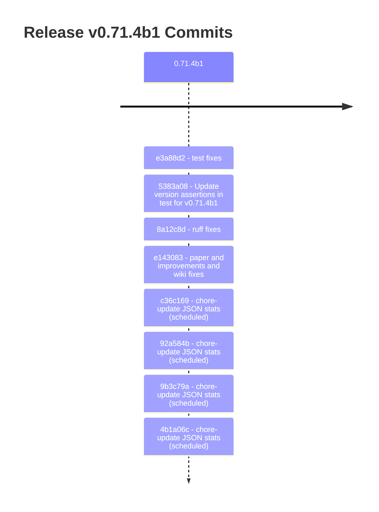
```mermaid
timeline
    title Release v0.71.4b1 Commits
    0.71.4b1
        : e3a88d2 - test fixes
        : 5383a08 - Update version assertions in test for v0.71.4b1
        : 8a12c8d - ruff fixes
        : e143083 - paper and improvements and wiki fixes
        : c36c169 - chore- update JSON stats (scheduled)
        : 92a584b - chore- update JSON stats (scheduled)
        : 9b3c79a - chore- update JSON stats (scheduled)
        : 4b1a06c - chore- update JSON stats (scheduled)
```

## Release v0.71.4b2 (2026-07-26)

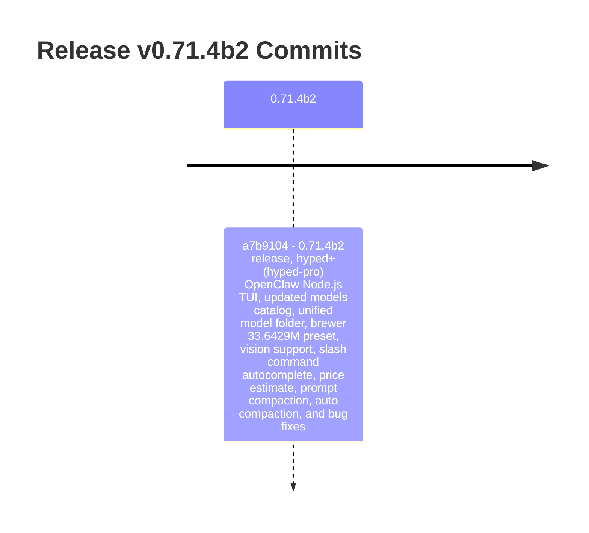
```mermaid
timeline
    title Release v0.71.4b2 Commits
    0.71.4b2
        : a7b9104 - 0.71.4b2 release, hyped+ (hyped-pro) OpenClaw Node.js TUI, updated models catalog, unified model folder, brewer 33.6429M preset, vision support, slash command autocomplete, price estimate, prompt compaction, auto compaction, and bug fixes
```

## Release v0.71.4b2 (2026-07-26)

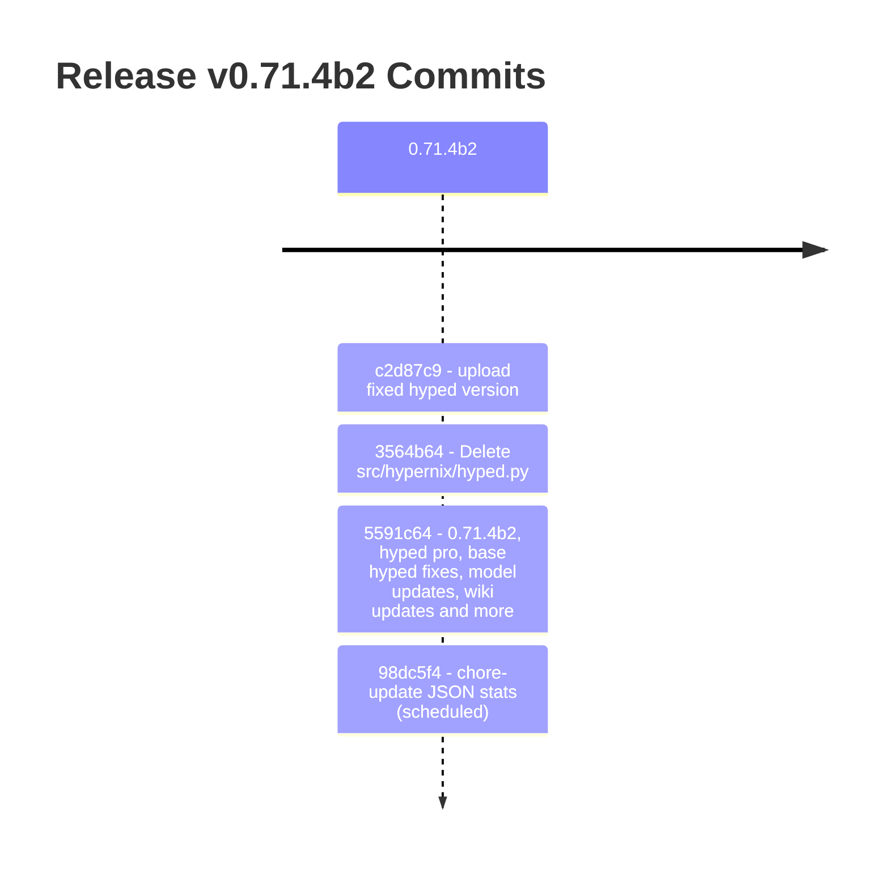
```mermaid
timeline
    title Release v0.71.4b2 Commits
    0.71.4b2
        : c2d87c9 - upload fixed hyped version
        : 3564b64 - Delete src/hypernix/hyped.py
        : 5591c64 - 0.71.4b2, hyped pro, base hyped fixes, model updates, wiki updates and more
        : 98dc5f4 - chore- update JSON stats (scheduled)
```

## Release v0.71.4b2 (2026-07-26)

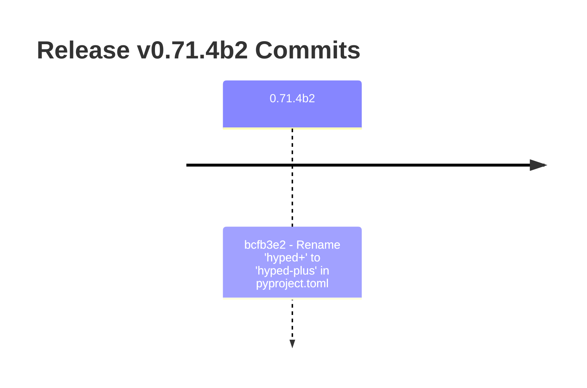
```mermaid
timeline
    title Release v0.71.4b2 Commits
    0.71.4b2
        : bcfb3e2 - Rename 'hyped+' to 'hyped-plus' in pyproject.toml
```

## Release v0.71.4b3 (2026-07-27)

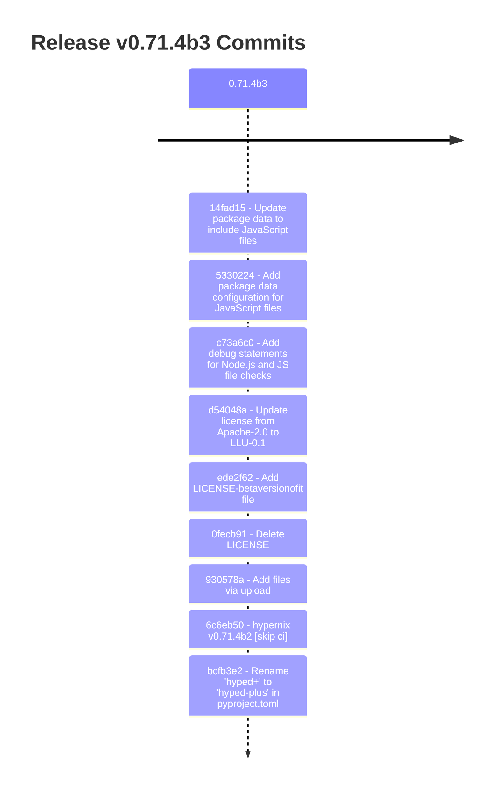
```mermaid
timeline
    title Release v0.71.4b3 Commits
    0.71.4b3
        : 14fad15 - Update package data to include JavaScript files
        : 5330224 - Add package data configuration for JavaScript files
        : c73a6c0 - Add debug statements for Node.js and JS file checks
        : d54048a - Update license from Apache-2.0 to LLU-0.1
        : ede2f62 - Add LICENSE-betaversionofit file
        : 0fecb91 - Delete LICENSE
        : 930578a - Add files via upload
        : 6c6eb50 - hypernix v0.71.4b2 [skip ci]
        : bcfb3e2 - Rename 'hyped+' to 'hyped-plus' in pyproject.toml
```

## Release v0.71.4b4 (2026-07-27)

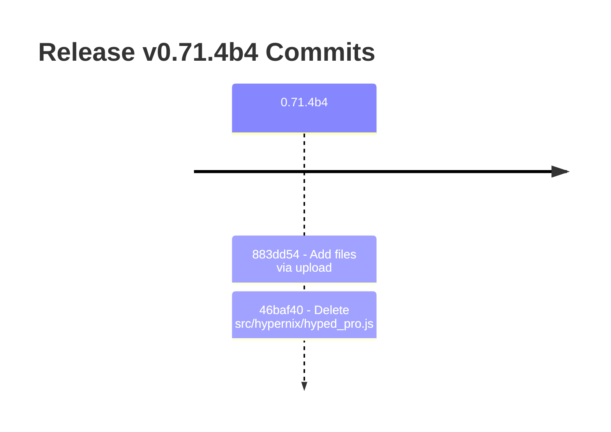
```mermaid
timeline
    title Release v0.71.4b4 Commits
    0.71.4b4
        : 883dd54 - Add files via upload
        : 46baf40 - Delete src/hypernix/hyped_pro.js
```

## Release v0.71.4b5 (2026-07-28)

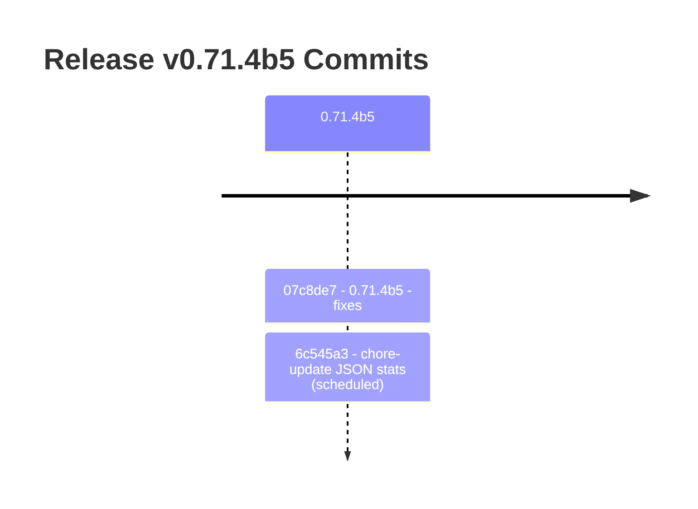
```mermaid
timeline
    title Release v0.71.4b5 Commits
    0.71.4b5
        : 07c8de7 - 0.71.4b5 - fixes
        : 6c545a3 - chore- update JSON stats (scheduled)
```

## Release v0.71.4rc1 (2026-08-05)

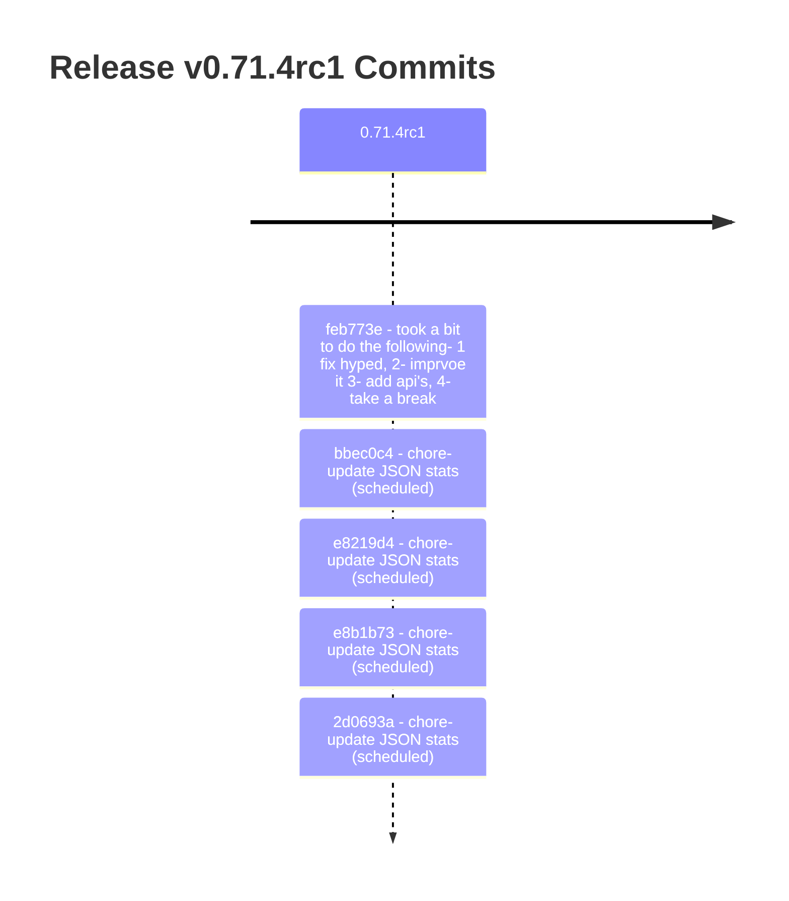
```mermaid
timeline
    title Release v0.71.4rc1 Commits
    0.71.4rc1
        : feb773e - took a bit to do the following- 1 fix hyped, 2- imprvoe it 3- add api's, 4- take a break
        : bbec0c4 - chore- update JSON stats (scheduled)
        : e8219d4 - chore- update JSON stats (scheduled)
        : e8b1b73 - chore- update JSON stats (scheduled)
        : 2d0693a - chore- update JSON stats (scheduled)
```

## Release v0.71.4 (2026-08-05)

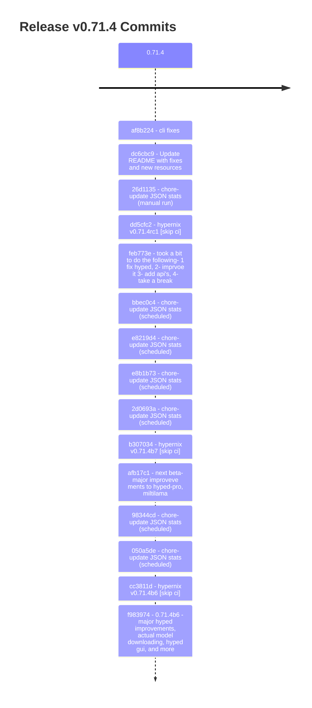
```mermaid
timeline
    title Release v0.71.4 Commits
    0.71.4
        : af8b224 - cli fixes
        : dc6cbc9 - Update README with fixes and new resources
        : 26d1135 - chore- update JSON stats (manual run)
        : dd5cfc2 - hypernix v0.71.4rc1 [skip ci]
        : feb773e - took a bit to do the following- 1 fix hyped, 2- imprvoe it 3- add api's, 4- take a break
        : bbec0c4 - chore- update JSON stats (scheduled)
        : e8219d4 - chore- update JSON stats (scheduled)
        : e8b1b73 - chore- update JSON stats (scheduled)
        : 2d0693a - chore- update JSON stats (scheduled)
        : b307034 - hypernix v0.71.4b7 [skip ci]
        : afb17c1 - next beta- major improveve ments to hyped-pro, miltilama
        : 98344cd - chore- update JSON stats (scheduled)
        : 050a5de - chore- update JSON stats (scheduled)
        : cc3811d - hypernix v0.71.4b6 [skip ci]
        : f983974 - 0.71.4b6 - major hyped improvements, actual model downloading, hyped gui, and more
```

## Release v0.71.4-1 (2026-08-06)

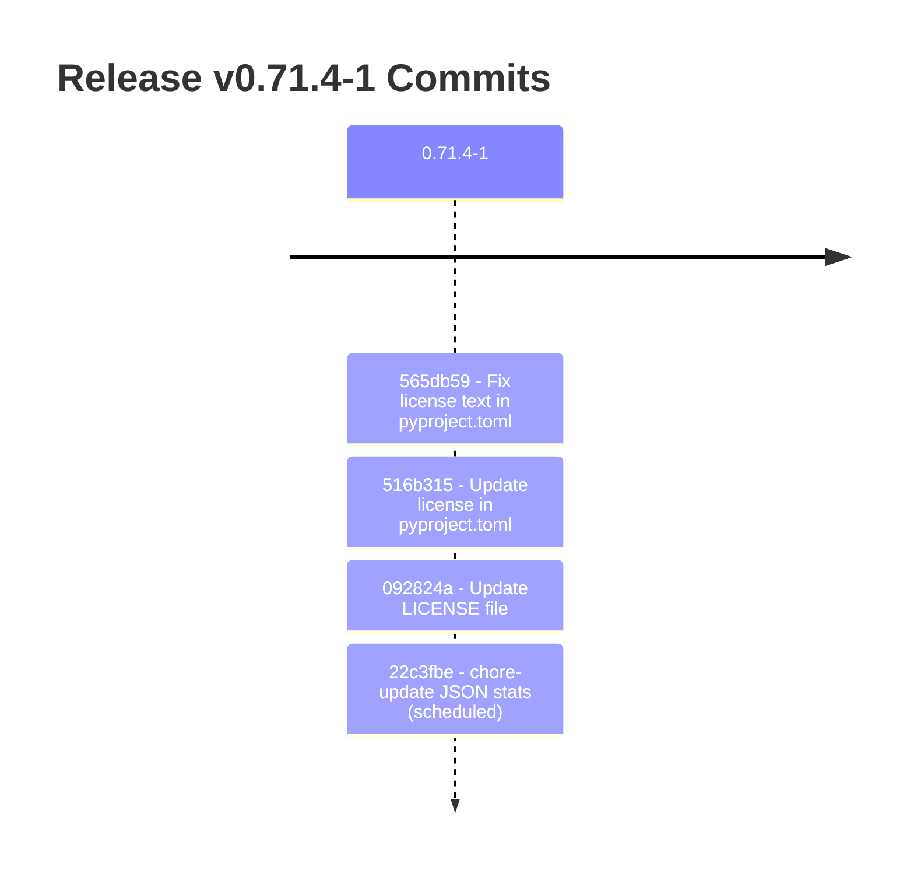
```mermaid
timeline
    title Release v0.71.4-1 Commits
    0.71.4-1
        : 565db59 - Fix license text in pyproject.toml
        : 516b315 - Update license in pyproject.toml
        : 092824a - Update LICENSE file
        : 22c3fbe - chore- update JSON stats (scheduled)
```

## Release v0.71.4-2 (2026-08-09)

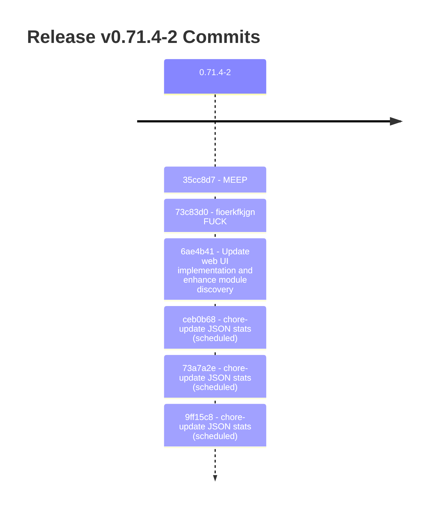
```mermaid
timeline
    title Release v0.71.4-2 Commits
    0.71.4-2
        : 35cc8d7 - MEEP
        : 73c83d0 - fioerkfkjgn FUCK
        : 6ae4b41 - Update web UI implementation and enhance module discovery
        : ceb0b68 - chore- update JSON stats (scheduled)
        : 73a7a2e - chore- update JSON stats (scheduled)
        : 9ff15c8 - chore- update JSON stats (scheduled)
```

## Release v0.71.4-3 (2026-08-09)

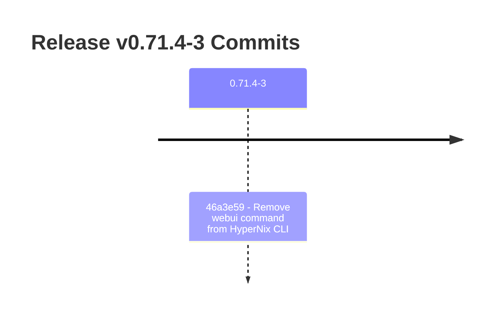
```mermaid
timeline
    title Release v0.71.4-3 Commits
    0.71.4-3
        : 46a3e59 - Remove webui command from HyperNix CLI
```

## Release v0.71.4-4 (2026-08-11)

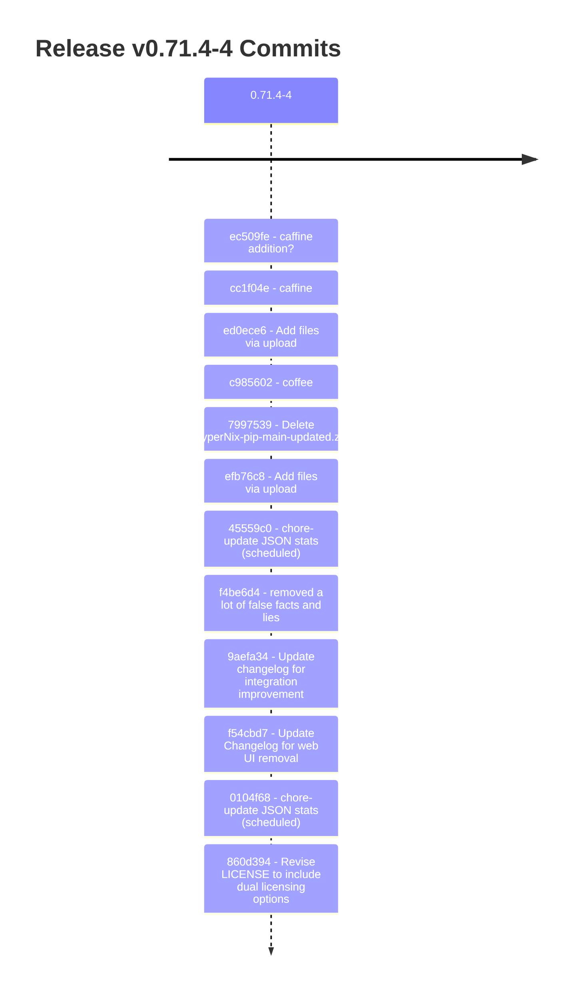
```mermaid
timeline
    title Release v0.71.4-4 Commits
    0.71.4-4
        : ec509fe - caffine addition?
        : cc1f04e - caffine
        : ed0ece6 - Add files via upload
        : c985602 - coffee
        : 7997539 - Delete HyperNix-pip-main-updated.zip
        : efb76c8 - Add files via upload
        : 45559c0 - chore- update JSON stats (scheduled)
        : f4be6d4 - removed a lot of false facts and lies
        : 9aefa34 - Update changelog for integration improvement
        : f54cbd7 - Update Changelog for web UI removal
        : 0104f68 - chore- update JSON stats (scheduled)
        : 860d394 - Revise LICENSE to include dual licensing options
```

## Release v0.71.4-5 (2026-08-16)

```mermaid
timeline
    title Release v0.71.4-5 Commits
    0.71.4-5
        : 626b562 - chore- update JSON stats (scheduled)
        : 5b91d75 - chore- update JSON stats (scheduled)
        : 9124d73 - chore- update JSON stats (scheduled)
        : a76b5b0 - Update Changelog with unfixed known bug note
        : 8a194f1 - Revise changelog for version 0.71.5
        : 623b9f8 - pc-v6+pc-v6v, other changes
        : f353068 - chore- update JSON stats (scheduled)
        : 338c2c3 - chore- update JSON stats (scheduled)
        : 63e58d3 - Revise Nix family section and model notes
        : b974f12 - Delete hypernix_fixes.diff
        : b0ebbce - Delete fix-hyped-dict-logits(1).patch
        : dc99f2d - Delete hypernix_pressure_cooker_v5_v5s.patch
        : 6ae442b - Delete ci-fixes-v8.patch
        : de808de - chore- update JSON stats (scheduled)
        : 883ffdd - chore- update JSON stats (manual run)
```

## Release v0.71.5a2 (2026-08-17)

```mermaid
timeline
    title Release v0.71.5a2 Commits
    0.71.5a2
        : 15aa12b - fixes
        : ee23dc0 - ruff fixes
        : 33d668c - 0.71.5a1 and a2
```

## Release v0.71.5postr1 (2026-08-21)

```mermaid
timeline
    title Release v0.71.5postr1 Commits
    0.71.5postr1
        : 49b678b - Adjust sleep durations in timer test cases
        : 293a22c - ci fixes
        : e9bcd09 - win fixes
        : 5b0268e - win fixes
        : 56c17b9 - Revise trademark section to unique naming
        : da87eda - Delete hypernix-ci-fixes.patch
        : bccc73e - fixes
        : 604ec86 - b2
        : 9017d71 - chore- update JSON stats (scheduled)
        : 5e3b3e6 - chore- update JSON stats (scheduled)
        : f836d29 - 0.71.5b1-part one of four for the api
        : 1438264 - chore- update JSON stats (scheduled)
        : 1d75aa0 - chore- update JSON stats (scheduled)
```

